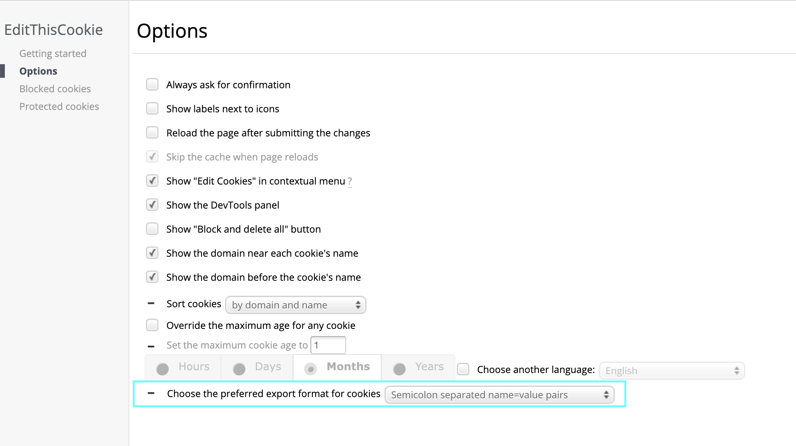
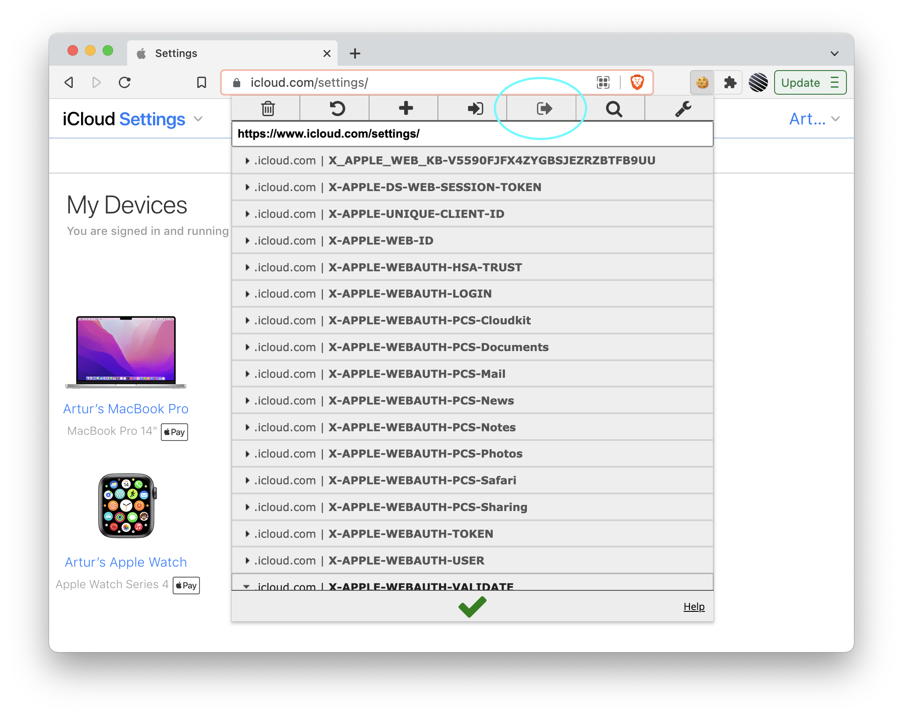

#iCloud HideMyEmail Generator

> Automated generation of Apple's iCloud emails via HideMyEmail.

_You do need to have an active iCloud+ subscription to be able to generate iCloud emails..._

## Setup

> Python 3.9+ is required!

1. Clone this repository

```bash
git clone https://github.com/rtunazzz/hidemyemail-generator
```

2. Install required modules

```bash
pip install -r requirements.txt
```

## Getting iCloud cookie string

> There is more than one way how you can get the required cookie string but this one is _imo_ the simplest...

1. Download [EditThisCookie](https://chrome.google.com/webstore/detail/editthiscookie/fngmhnnpilhplaeedifhccceomclgfbg) Chrome extension

2. Go to [EditThisCookie settings page](chrome-extension://fngmhnnpilhplaeedifhccceomclgfbg/options_pages/user_preferences.html) and set the preferred export format to `Semicolon separated name=value pairs`

<p align="center"></p>

3. Navigate to [iCloud settings](https://www.icloud.com/settings/) in your browser and log in

4. Click on the EditThisCookie extension and export cookies

<p align="center"></p>

5. Remove the following lines from the `cookie.txt` file:

```txt
// Semicolon separated Cookie File
// This file was generated by EditThisCookie
// Details: http://www.ietf.org/rfc/rfc2109.txt
// Example: http://www.tutorialspoint.com/javascript/javascript_cookies.htm
```
