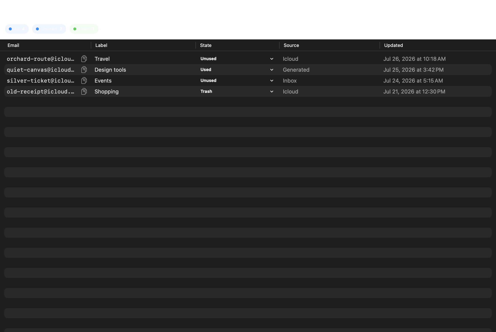
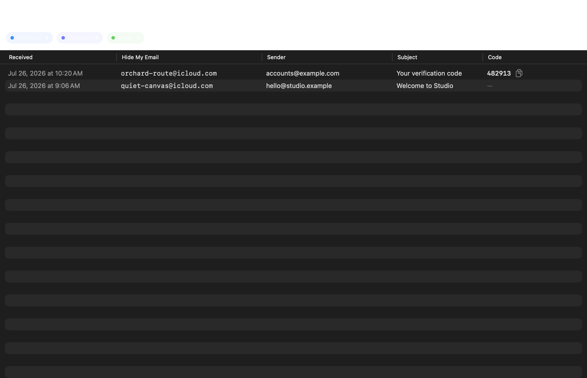

<p align="center">
  
</p>

<h1 align="center">HideMyEmail Generator</h1>

<p align="center">
  Generate, reserve, and manage iCloud Hide My Email addresses from a native macOS app or local CLI.
  <br>
  Includes native macOS sign-in, a Windows launcher, iCloud China support, and a local inbox.
</p>

<p align="center">
  <a href="LICENSE"></a>
  
  <a href="../../releases/latest"></a>
  <a href="../../releases"></a>
</p>

<p align="center">
  <strong>English</strong>
  ·
  <a href="./README.zh-CN.md">简体中文</a>
  ·
  <a href="./README.ru.md">Русский</a>
</p>

> You need an active iCloud+ subscription to generate Hide My Email addresses.

## App Preview

<p align="center">
  <a href="../../releases/latest/download/HideMyEmail-Generator-macOS-Apple-Silicon.dmg"><strong>Download for Apple Silicon (.dmg)</strong></a>
  ·
  <a href="../../releases/latest/download/HideMyEmail-Generator-macOS-Intel.dmg"><strong>Download for Intel (.dmg)</strong></a>
</p>

<p align="center">
  
</p>

- Generate one address or a batch with a custom label.
- Manage local `unused`, `used`, and `trash` addresses alongside the live active
  or inactive iCloud inventory.
- Connect a receiving mailbox, sync forwarded messages, and copy extracted
  verification codes without leaving the app.
- Copy individual addresses, copy everything, or export local history and CSV data.
- Schedule larger batches; the app pauses and resumes when Apple rate-limits creation.
- Sign in natively, keep the session in Keychain, and see connection status at a glance.
- Keep everything private: address history stays local and the app collects no telemetry.

<p align="center">
  
  
</p>

## Overview

HideMyEmail Generator is a local macOS app and command-line utility for Apple's
iCloud Hide My Email service. It generates and reserves new addresses, lists
active or inactive ones, and inspects the account behind the current iCloud
session.

Alongside the basics it provides:

- region-aware iCloud API targeting for `global` and `china`;
- automatic iCloud partition detection;
- a native SwiftUI macOS app with in-app iCloud sign-in;
- a one-click Windows launcher;
- bilingual English / Simplified Chinese launcher and CLI output;
- account-aware cookie management with browser-assisted capture;
- a local IMAP inbox with verification-code extraction;
- local address state management (`unused`, `used`, `trash`);
- CSV export for addresses and received messages;
- longer timeouts and automatic retries for slower iCloud responses.

## Contents

- [App Preview](#app-preview)
- [Highlights](#highlights)
- [Quick Start](#quick-start)
- [macOS App](#macos-app)
- [Windows Launcher](#windows-launcher)
- [CLI Reference](#cli-reference)
- [Cookie Management](#cookie-management)
- [Local Inbox and Codes](#local-inbox-and-codes)
- [Configuration](#configuration)
- [Generated Files](#generated-files)
- [Troubleshooting](#troubleshooting)
- [Security and Privacy](#security-and-privacy)
- [Rate Limits](#rate-limits)
- [Disclaimer](#disclaimer)
- [Acknowledgements](#acknowledgements)
- [License](#license)

## Highlights

| Capability | Description |
| --- | --- |
| Generate addresses | Create and reserve iCloud Hide My Email addresses with a label. |
| List addresses | List active or inactive Hide My Email addresses. |
| Account check | Show the Apple ID, DSID, user partition, and Hide My Email availability for the saved cookie. |
| iCloud China support | Use `icloud.com.cn` origins, setup validation, and maildomain hosts. |
| Partition detection | Derive the correct `pNNN-maildomainws` host from captured requests or account validation. |
| Native macOS app | Generate batches, browse and export local history, and automatically wait through rate limits. |
| Windows launcher | Double-click menu for generation, listing, and cookie management. |
| Bilingual UI | Launcher and CLI help include English and Simplified Chinese text. |
| Cookie capture | Open iCloud Plus, click Hide My Email, capture the app request, and save the cookie locally. |
| Local inbox | Fetch forwarded mail through IMAP and extract verification codes locally. |
| Status workflow | Track addresses as `unused`, `used`, or `trash`. |
| CSV export | Export local address and message data for spreadsheet workflows. |

## Quick Start

### Download a prebuilt binary

Grab a standalone binary from the [latest release](../../releases/latest) — no Python or `uv` required.

- **Windows:** download `hidemyemail-windows.exe`. Double-click it to open the interactive menu, or run it from a terminal with arguments for CLI usage (`hidemyemail-windows.exe --help`).
- **macOS app:** download the
  [Apple Silicon DMG](../../releases/latest/download/HideMyEmail-Generator-macOS-Apple-Silicon.dmg)
  for M-series Macs or the
  [Intel DMG](../../releases/latest/download/HideMyEmail-Generator-macOS-Intel.dmg)
  for Intel Macs, then right-click the app and choose **Open** the first time.
- **macOS CLI:** download `hidemyemail-macos` for Apple Silicon or `hidemyemail-macos-x86_64` for Intel. Make it executable with `chmod +x`, then run it from Terminal.

The native app captures its own iCloud session after you sign in. Prebuilt CLI
binaries still use manual cookie capture; Playwright capture is available only
when running the CLI from source.

### Run from source

```bash
git clone https://github.com/rtunazzz/hidemyemail-generator.git
cd hidemyemail-generator
uv sync --python 3.12
```

On Windows, double-click `start-hidemyemail.bat`. For direct CLI usage:

```bash
uv run hidemyemail --help
```

## macOS App

The app requires macOS 13 or newer. It bundles the CLI helper, so Python and
`uv` are not required.

1. Open the app and choose **Connect iCloud**.
2. Complete Apple's system account prompt or fallback sign-in form. The iCloud
   session is captured from the authenticated Hide My Email request before its
   page loads. The window closes automatically when the session validates.
3. Use **Generate** for one address or a batch, manage local and live iCloud
   inventory from **Addresses**, connect a receiving mailbox under **Inbox**,
   or use **Scheduler** to create addresses at a configurable interval until a
   target is reached.

The session cookie is validated locally and stored in macOS Keychain. Every
helper invocation receives it through an owner-only temporary file that is
deleted immediately afterward. Generated addresses are also appended to
`~/Library/Application Support/HideMyEmail Generator/emails.txt`. The
**History** scope stores each address, label, and generation time in a local
owner-only history file. Address workflow state, inbox metadata, and extracted
codes stay in `hidemyemail.db` in the same Application Support directory.

The app stores an optional IMAP password or app password in macOS Keychain and
keeps only non-secret inbox settings in app preferences. It creates an
owner-only temporary CLI config for each inbox sync and deletes it immediately.
This is intentionally separate from the CLI's `inbox_config.json` workflow.

If Apple rate-limits creation, the app preserves completed addresses, shows a
countdown, and retries after at least 30 minutes while the app remains open.
Use **Import Cookie File…** only if embedded sign-in does not provide the
required cookie.

To build the unsigned app from source:

```bash
scripts/build-macos-app.sh "$(uname -m)"
```

Run this after every change to the Swift app. It removes and regenerates the
matching app under `build/` and its ZIP and DMG under `dist/`, so those folders
never continue to serve an older UI.

The script builds one exact architecture and refuses cross-architecture
packaging. Run it on Apple Silicon for the Apple Silicon app and on an Intel
Mac (or the matching GitHub runner) for the Intel app.

### Releasing

macOS updates use Sparkle and are published only from version tags. The
verification public key is embedded in `macos/Info.plist`.

1. Bump the version in `pyproject.toml`, `uv.lock`, and `macos/Info.plist`.
2. Merge the tested change to `main`.
3. Tag that commit with the matching `v`-prefixed version, such as `v2.1.0`.

The release workflow rejects mismatched tags or a missing signing key, builds
both Mac architectures, signs their appcasts, and publishes only after every
artifact passes.

## Windows Launcher

The Windows launcher is the recommended entry point for Windows users.

```text
1. Generate emails
2. List active emails
3. List inactive emails
4. Manage iCloud cookie
5. Local inbox and codes
6. Exit
```

Cookie management:

```text
1. Show current cookie account
2. Replace iCloud cookie
3. Auto capture iCloud cookie
4. Back
```

Inbox management:

```text
1. Configure inbox IMAP account
2. Sync inbox and show verification codes
3. Show recent verification codes
4. Show recent inbox messages
5. List unused local emails
6. Mark email as used
7. Move email to trash
8. Sync iCloud HME addresses to local DB
9. Export CSV files
10. Back
```

The launcher defaults to the `global` region. To target iCloud China, set the
environment variable before launching:

```text
HIDEMYEMAIL_REGION=china
```

## CLI Reference

Commands default to the `global` region. Add `--region china` (or set
`HIDEMYEMAIL_REGION=china`) to target iCloud China.

### Generate

```bash
uv run hidemyemail generate --label test --count 1 --cookie-file cookies.txt
```

Options:

| Option | Description |
| --- | --- |
| `--label` | Label assigned to generated addresses. Required. |
| `--count` | Number of addresses to generate. Defaults to `1`. |
| `--cookie-file` | Path to the saved cookie file. Defaults to `cookies.txt`. |
| `--output` | File used to append generated addresses. Defaults to `emails.txt`. |
| `--no-output-file` | Print results without writing to an output file. |
| `--region` | `global` (default) or `china`. |
| `--result-json` | Write a machine-readable result for integrations such as the macOS app. |

### List

```bash
uv run hidemyemail list --active --cookie-file cookies.txt
uv run hidemyemail list --inactive --cookie-file cookies.txt
```

### Account Check

```bash
uv run hidemyemail whoami --cookie-file cookies.txt
```

Example output:

```text
Current iCloud Cookie
Apple ID       user@example.com
Name           Example User
DSID           ***********
Hide My Email  Available
User Partition 68
Maildomain     p68-maildomainws.icloud.com
```

### Auto Capture Cookie

```bash
uv sync --extra capture
uv run hidemyemail capture-cookie --cookie-file cookies.txt
```

### Local Inbox

Configure the receiving mailbox used by iCloud Hide My Email forwarding:

```bash
uv run hidemyemail inbox setup
```

Sync the latest inbox messages and show extracted verification codes:

```bash
uv run hidemyemail inbox sync --limit 100 --show-codes
```

Show recent codes:

```bash
uv run hidemyemail inbox codes --limit 30
```

Sync existing iCloud Hide My Email addresses into the local database:

```bash
uv run hidemyemail inbox sync-hme --cookie-file cookies.txt
```

Track address state:

```bash
uv run hidemyemail inbox addresses --state unused
uv run hidemyemail inbox mark example@icloud.com used
uv run hidemyemail inbox mark example@icloud.com trash
```

Export local CSV files:

```bash
uv run hidemyemail inbox export
```

## Cookie Management

The tool needs an authenticated iCloud browser cookie. Cookies stay local in
`cookies.txt`, which is ignored by Git.

### Automatic Capture

1. Run `start-hidemyemail.bat`.
2. Choose `4. Manage iCloud cookie`.
3. Choose `3. Auto capture iCloud cookie`.
4. Log in in the opened browser window if needed.
5. The tool opens iCloud Plus, clicks Hide My Email, captures the app request,
   validates the cookie, and writes `cookies.txt`.

The capture flow listens for the Hide My Email app request:

```text
https://www.icloud.com/applications/hidemyemail/current/en-us/index.html?rootDomain=www
```

For iCloud China the host is `www.icloud.com.cn` and the locale segment is
`zh-cn`.

It uses a separate browser profile:

```text
.cookie-browser-profile
```

It does not read your everyday browser profile. If a new cookie is captured,
the previous file is backed up as:

```text
cookies.txt.bak
```

### Manual Capture

1. Open `https://www.icloud.com/icloudplus/` (use `www.icloud.com.cn` for China).
2. Press `F12`.
3. Open `Network`.
4. Click the `Hide My Email` tile (`隐藏邮件地址` on China).
5. Find the request ending with:

   ```text
   /applications/hidemyemail/current/en-us/index.html?rootDomain=www
   ```

6. Right-click the request and choose `Copy` -> `Copy as cURL`.
7. Paste the entire copied text into `cookies.txt`.

Raw `Cookie:` header strings also work.

## Local Inbox and Codes

The local inbox feature uses IMAP to read the mailbox that receives forwarded
mail from iCloud Hide My Email. It stores message metadata, matched Hide My Email
addresses, and extracted verification codes in a local SQLite database.

What it does:

- connects to your receiving mailbox through IMAP;
- fetches new messages from the configured folder;
- extracts likely verification codes from subjects and message bodies;
- links messages to known Hide My Email addresses when possible;
- tracks local address state as `unused`, `used`, or `trash`;
- exports `addresses.csv` and `messages.csv`.

What it does not do:

- it does not upload mail or codes to any server;
- it does not require public deployment;
- it does not read your everyday browser profile;
- it does not bypass Apple or mailbox provider rate limits.

For many mail providers, you should use an app password instead of your normal
mailbox password.

## Configuration

| Setting | Values | Notes |
| --- | --- | --- |
| `--region` | `china`, `global` | Selects iCloud China or global iCloud endpoints. |
| `HIDEMYEMAIL_REGION` | `china`, `global` | Optional default region for the CLI and launcher. Defaults to `global`. |
| `cookies.txt` | local file | Stores the captured cookie in a Git-ignored file. |
| `emails.txt` | local file | Stores generated addresses unless `--no-output-file` is used. |
| `inbox_config.json` | local file | Stores IMAP settings for the receiving mailbox. |
| `hidemyemail.db` | local file | SQLite database for addresses, message metadata, and codes. |

## Generated Files

These files are local-only and ignored by Git:

- `cookies.txt`
- `cookies.txt.bak`
- `emails.txt`
- `hidemyemail.db`
- `hidemyemail.db-*`
- `inbox_config.json`
- `exports/`
- `.cookie-browser-profile/`
- `.venv/`

## Troubleshooting

| Symptom | Fix |
| --- | --- |
| `Missing X-APPLE-WEBAUTH-USER cookie` | Capture the Hide My Email app request instead of `feedbackws/reportStats`. |
| `Request timed out` | Retry. The CLI uses longer timeouts and retries, but iCloud may still be slow. |
| Cookie account is wrong | Use launcher option `4 -> 1` to verify, then `4 -> 3` to capture a new cookie. |
| Browser does not open for capture | Install Microsoft Edge, then run `uv sync --extra capture` or `uv run playwright install chromium`. |
| Chinese text looks garbled in old consoles | Use the launcher; it switches the console to UTF-8. |
| IMAP login fails | Enable IMAP in your mailbox provider and use an app password if required. |
| No verification code is detected | Open `hidemyemail inbox messages` and inspect the subject/body preview; some providers use non-standard formats. |

## Security and Privacy

- Cookies are stored locally and ignored by Git.
- The macOS app stores its validated session in Keychain and never stores or logs the Apple Account password.
- IMAP secrets entered in the macOS app are stored in Keychain, never in app preferences or process arguments.
- The macOS app uses owner-only temporary cookie files and deletes them after each helper invocation.
- The macOS app contains no analytics, telemetry, advertising, or crash-reporting SDK. It connects only to Apple's iCloud endpoints and, when Inbox is configured, the user's chosen IMAP server.
- IMAP configuration and local mailbox data are stored locally and ignored by Git.
- Automatic capture uses a separate browser profile.
- The project does not intentionally collect, upload, or share your cookies, email data, or verification codes.
- Do not commit `cookies.txt`, `cookies.txt.bak`, `emails.txt`, `inbox_config.json`, `hidemyemail.db`, exports, or browser profile data.
- If a token or cookie is accidentally exposed, revoke it from the provider dashboard.

## Rate Limits

Apple may rate-limit Hide My Email creation. Observed limits are roughly
`5 * number of people in your iCloud family` new addresses every 30 minutes,
with a total cap around 700 addresses.

The macOS app does not bypass this limit. It generates sequentially and resumes
after a cooldown when Apple returns error `-41015`.

## Disclaimer

This project is an independent community tool and is not affiliated with,
endorsed by, or sponsored by Apple Inc. Apple, iCloud, and Hide My Email are
trademarks of Apple Inc.

## Acknowledgements

- iCloud China support, the Windows launcher, and the local inbox were
  contributed by [@never-seek](https://github.com/never-seek).
- Thanks to all other [community contributors](https://github.com/rtunazzz/hidemyemail-generator/graphs/contributors).

## License

MIT. See [LICENSE](./LICENSE).
