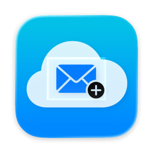
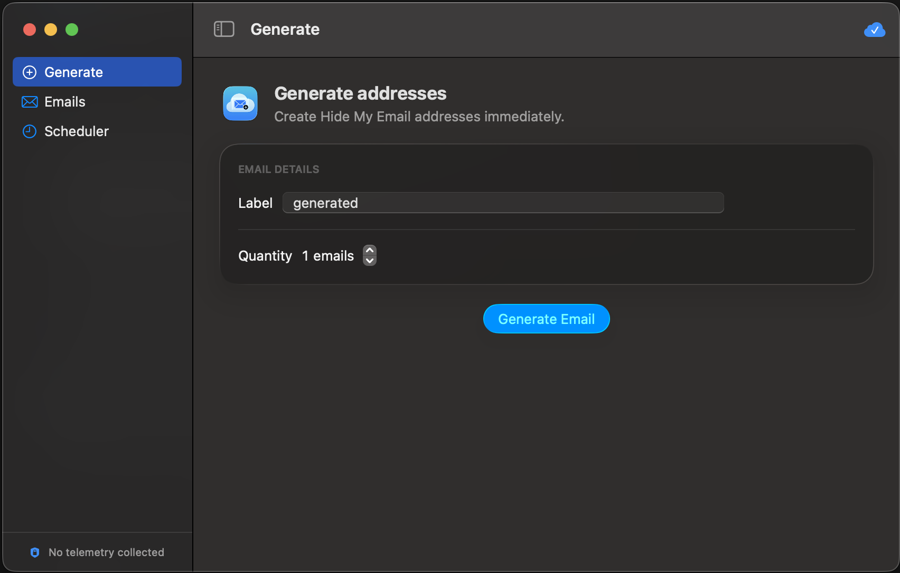
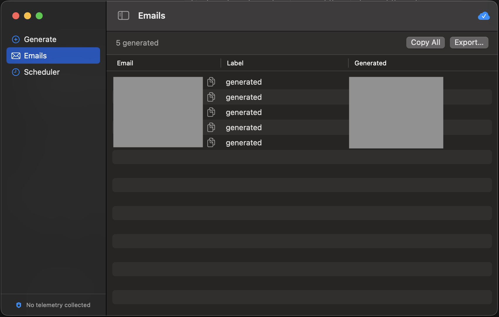
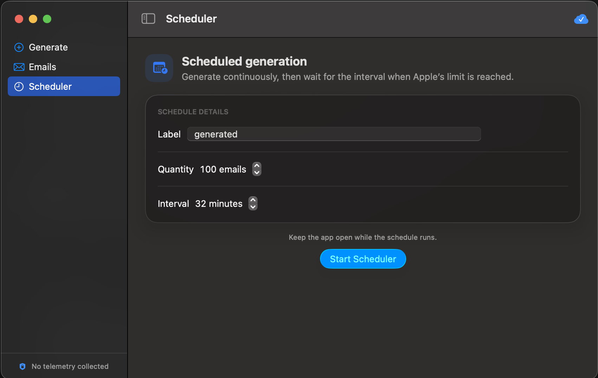

<p align="center">
  
</p>

<h1 align="center">HideMyEmail Generator</h1>

<p align="center">
  Генерируйте, резервируйте и управляйте адресами iCloud «Скрыть e-mail» (Hide My Email) через нативное macOS-приложение или локальный CLI.
  <br>
  Включает нативный вход в macOS, лаунчер для Windows, поддержку iCloud Китая и локальный почтовый ящик.
</p>

<p align="center">
  <a href="LICENSE"></a>
  
  <a href="../../releases/latest"></a>
  <a href="../../releases"></a>
</p>

<p align="center">
  <a href="./README.md">English</a>
  ·
  <a href="./README.zh-CN.md">简体中文</a>
  ·
  <strong>Русский</strong>
</p>

> Для генерации адресов Hide My Email нужна активная подписка iCloud+.

## Предпросмотр приложения

<p align="center">
  <a href="../../releases/latest/download/HideMyEmail-Generator-macOS-Apple-Silicon.dmg"><strong>Скачать для Apple Silicon (.dmg)</strong></a>
  ·
  <a href="../../releases/latest/download/HideMyEmail-Generator-macOS-Intel.dmg"><strong>Скачать для Intel (.dmg)</strong></a>
</p>

<p align="center">
  
</p>

- Генерируйте один адрес или партию с собственной меткой.
- Копируйте отдельные адреса, всё сразу или экспортируйте локальную историю.
- Планируйте крупные партии: приложение ставит генерацию на паузу и возобновляет её, когда Apple ограничивает частоту.
- Входите нативно, храните сессию в Связке ключей и следите за статусом подключения.
- Всё остаётся приватным: история адресов хранится локально, приложение не собирает телеметрию.

<p align="center">
  
  
</p>

## Обзор

HideMyEmail Generator — локальное macOS-приложение и утилита командной строки
для сервиса Apple iCloud Hide My Email. Она генерирует и резервирует новые
адреса, выводит список активных или неактивных и показывает аккаунт,
стоящий за текущей сессией iCloud.

Помимо базовых возможностей:

- выбор региона iCloud API: `global` и `china`;
- автоматическое определение партиции iCloud;
- нативное SwiftUI-приложение для macOS со встроенным входом в iCloud;
- лаунчер для Windows в один клик;
- двуязычный (английский / упрощённый китайский) вывод лаунчера и CLI;
- управление cookie с привязкой к аккаунту и захватом через браузер;
- локальный IMAP-ящик с извлечением кодов подтверждения;
- локальное управление статусами адресов (`unused`, `used`, `trash`);
- экспорт адресов и полученных писем в CSV;
- увеличенные тайм-ауты и автоматические повторы при медленных ответах iCloud.

## Содержание

- [Предпросмотр приложения](#предпросмотр-приложения)
- [Возможности](#возможности)
- [Быстрый старт](#быстрый-старт)
- [Приложение для macOS](#приложение-для-macos)
- [Лаунчер для Windows](#лаунчер-для-windows)
- [Справочник CLI](#справочник-cli)
- [Управление cookie](#управление-cookie)
- [Локальный ящик и коды](#локальный-ящик-и-коды)
- [Настройки](#настройки)
- [Создаваемые файлы](#создаваемые-файлы)
- [Решение проблем](#решение-проблем)
- [Безопасность и приватность](#безопасность-и-приватность)
- [Ограничения частоты](#ограничения-частоты)
- [Отказ от ответственности](#отказ-от-ответственности)
- [Благодарности](#благодарности)
- [Лицензия](#лицензия)

## Возможности

| Возможность | Описание |
| --- | --- |
| Генерация адресов | Создание и резервирование адресов iCloud Hide My Email с меткой. |
| Список адресов | Вывод активных или неактивных адресов Hide My Email. |
| Проверка аккаунта | Показ Apple ID, DSID, партиции пользователя и доступности Hide My Email для сохранённого cookie. |
| Поддержка iCloud Китая | Использование доменов `icloud.com.cn`, проверка настроек и maildomain-хостов. |
| Определение партиции | Вычисление правильного хоста `pNNN-maildomainws` из захваченных запросов или проверки аккаунта. |
| Нативное приложение macOS | Генерация партиями, просмотр и экспорт локальной истории, автоматическое ожидание при ограничениях. |
| Лаунчер для Windows | Меню в два клика для генерации, списков и управления cookie. |
| Двуязычный интерфейс | Лаунчер и справка CLI содержат английский и упрощённый китайский текст. |
| Захват cookie | Открытие iCloud Plus, клик по Hide My Email, захват запроса приложения и локальное сохранение cookie. |
| Локальный ящик | Получение пересланной почты по IMAP и локальное извлечение кодов подтверждения. |
| Статусы адресов | Отслеживание адресов как `unused`, `used` или `trash`. |
| Экспорт CSV | Экспорт локальных адресов и писем для работы в таблицах. |

## Быстрый старт

### Скачать готовый бинарник

Возьмите автономный бинарник из [последнего релиза](../../releases/latest) — Python и `uv` не нужны.

- **Windows:** скачайте `hidemyemail-windows.exe`. Двойной клик откроет интерактивное меню, либо запустите из терминала с аргументами для CLI-режима (`hidemyemail-windows.exe --help`).
- **Приложение macOS:** скачайте
  [DMG для Apple Silicon](../../releases/latest/download/HideMyEmail-Generator-macOS-Apple-Silicon.dmg)
  для Mac на M-чипах или
  [DMG для Intel](../../releases/latest/download/HideMyEmail-Generator-macOS-Intel.dmg)
  для Intel Mac, затем при первом запуске кликните по приложению правой кнопкой и выберите **Открыть**.
- **CLI для macOS:** скачайте `hidemyemail-macos` для Apple Silicon или `hidemyemail-macos-x86_64` для Intel. Сделайте файл исполняемым через `chmod +x` и запускайте из Терминала.

Нативное приложение захватывает свою сессию iCloud после входа. Готовые
CLI-бинарники по-прежнему используют ручной захват cookie; захват через
Playwright доступен только при запуске CLI из исходников.

### Запуск из исходников

```bash
git clone https://github.com/rtunazzz/hidemyemail-generator.git
cd hidemyemail-generator
uv sync --python 3.12
```

В Windows дважды кликните `start-hidemyemail.bat`. Для прямой работы с CLI:

```bash
uv run hidemyemail --help
```

## Приложение для macOS

Приложению нужна macOS 13 или новее. CLI-помощник встроен, поэтому Python и
`uv` не требуются.

1. Откройте приложение и выберите **Connect iCloud**.
2. Пройдите системный запрос учётной записи Apple или резервную форму входа.
   Сессия iCloud захватывается из аутентифицированного запроса Hide My Email
   до загрузки его страницы. Окно закроется автоматически после проверки
   сессии.
3. Используйте **Generate** для одного адреса или партии, просматривайте и
   экспортируйте их во вкладке **Emails**, либо запустите **Scheduler** для
   создания адресов с настраиваемым интервалом до достижения цели.

Cookie сессии проверяется локально и хранится в Связке ключей macOS. При
каждом вызове помощника cookie передаётся через временный файл, доступный
только владельцу и удаляемый сразу после вызова. Сгенерированные адреса также
дописываются в `~/Library/Application Support/HideMyEmail Generator/emails.txt`.
Вкладка **Emails** хранит каждый адрес, метку и время генерации в локальном
файле истории, доступном только владельцу.

Если Apple ограничивает частоту создания, приложение сохраняет готовые
адреса, показывает обратный отсчёт и повторяет попытку не раньше чем через
30 минут — пока приложение остаётся открытым. Используйте
**Import Cookie File…** только если встроенный вход не выдал нужный cookie.

Сборка неподписанного приложения из исходников:

```bash
scripts/build-macos-app.sh "$(uname -m)"
```

Запускайте это после каждого изменения Swift-приложения. Скрипт удаляет и
пересоздаёт соответствующее приложение в `build/` и его ZIP и DMG в `dist/`,
чтобы эти папки никогда не содержали устаревший интерфейс.

Скрипт собирает ровно одну архитектуру и отказывается от кросс-архитектурной
упаковки. Запускайте его на Apple Silicon для сборки под Apple Silicon и на
Intel Mac (или соответствующем GitHub-раннере) для сборки под Intel.

## Лаунчер для Windows

Лаунчер — рекомендуемая точка входа для пользователей Windows.

```text
1. Generate emails
2. List active emails
3. List inactive emails
4. Manage iCloud cookie
5. Local inbox and codes
6. Exit
```

Управление cookie:

```text
1. Show current cookie account
2. Replace iCloud cookie
3. Auto capture iCloud cookie
4. Back
```

Управление ящиком:

```text
1. Configure inbox IMAP account
2. Sync inbox and show verification codes
3. Show recent verification codes
4. Show recent inbox messages
5. List unused local emails
6. Mark email as used
7. Move email to trash
8. Sync iCloud HME addresses to local DB
9. Export CSV files
10. Back
```

По умолчанию лаунчер использует регион `global`. Для iCloud Китая установите
переменную окружения перед запуском:

```text
HIDEMYEMAIL_REGION=china
```

## Справочник CLI

Команды по умолчанию используют регион `global`. Добавьте `--region china`
(или установите `HIDEMYEMAIL_REGION=china`) для iCloud Китая.

### Генерация

```bash
uv run hidemyemail generate --label test --count 1 --cookie-file cookies.txt
```

Опции:

| Опция | Описание |
| --- | --- |
| `--label` | Метка, присваиваемая сгенерированным адресам. Обязательна. |
| `--count` | Количество адресов. По умолчанию `1`. |
| `--cookie-file` | Путь к файлу с cookie. По умолчанию `cookies.txt`. |
| `--output` | Файл, в который дописываются сгенерированные адреса. По умолчанию `emails.txt`. |
| `--no-output-file` | Вывести результат без записи в файл. |
| `--region` | `global` (по умолчанию) или `china`. |
| `--result-json` | Записать машиночитаемый результат для интеграций вроде приложения macOS. |

### Список

```bash
uv run hidemyemail list --active --cookie-file cookies.txt
uv run hidemyemail list --inactive --cookie-file cookies.txt
```

### Проверка аккаунта

```bash
uv run hidemyemail whoami --cookie-file cookies.txt
```

Пример вывода:

```text
Current iCloud Cookie
Apple ID       user@example.com
Name           Example User
DSID           ***********
Hide My Email  Available
User Partition 68
Maildomain     p68-maildomainws.icloud.com
```

### Автоматический захват cookie

```bash
uv sync --extra capture
uv run hidemyemail capture-cookie --cookie-file cookies.txt
```

### Локальный ящик

Настройте принимающий почтовый ящик, на который iCloud Hide My Email
пересылает письма:

```bash
uv run hidemyemail inbox setup
```

Синхронизируйте свежие письма и покажите извлечённые коды подтверждения:

```bash
uv run hidemyemail inbox sync --limit 100 --show-codes
```

Показать последние коды:

```bash
uv run hidemyemail inbox codes --limit 30
```

Синхронизировать существующие адреса iCloud Hide My Email в локальную базу:

```bash
uv run hidemyemail inbox sync-hme --cookie-file cookies.txt
```

Управление статусами адресов:

```bash
uv run hidemyemail inbox addresses --state unused
uv run hidemyemail inbox mark example@icloud.com used
uv run hidemyemail inbox mark example@icloud.com trash
```

Экспорт локальных CSV-файлов:

```bash
uv run hidemyemail inbox export
```

## Управление cookie

Инструменту нужен аутентифицированный браузерный cookie iCloud. Cookie
хранятся локально в `cookies.txt`, который игнорируется Git.

### Автоматический захват

1. Запустите `start-hidemyemail.bat`.
2. Выберите `4. Manage iCloud cookie`.
3. Выберите `3. Auto capture iCloud cookie`.
4. При необходимости войдите в открывшемся окне браузера.
5. Инструмент откроет iCloud Plus, кликнет Hide My Email, захватит запрос
   приложения, проверит cookie и запишет `cookies.txt`.

Захват отслеживает запрос приложения Hide My Email:

```text
https://www.icloud.com/applications/hidemyemail/current/en-us/index.html?rootDomain=www
```

Для iCloud Китая хост — `www.icloud.com.cn`, а сегмент локали — `zh-cn`.

Используется отдельный профиль браузера:

```text
.cookie-browser-profile
```

Ваш повседневный профиль браузера не читается. При захвате нового cookie
предыдущий файл сохраняется как:

```text
cookies.txt.bak
```

### Ручной захват

1. Откройте `https://www.icloud.com/icloudplus/` (для Китая — `www.icloud.com.cn`).
2. Нажмите `F12`.
3. Откройте вкладку `Network`.
4. Кликните по плитке `Hide My Email` (`隐藏邮件地址` в китайской версии).
5. Найдите запрос, оканчивающийся на:

   ```text
   /applications/hidemyemail/current/en-us/index.html?rootDomain=www
   ```

6. Кликните по запросу правой кнопкой и выберите `Copy` -> `Copy as cURL`.
7. Вставьте весь скопированный текст в `cookies.txt`.

Сырые строки заголовка `Cookie:` тоже работают.

## Локальный ящик и коды

Локальный ящик использует IMAP для чтения почтового ящика, на который iCloud
Hide My Email пересылает письма. Метаданные писем, сопоставленные адреса Hide
My Email и извлечённые коды подтверждения сохраняются в локальной базе SQLite.

Что он делает:

- подключается к вашему принимающему ящику по IMAP;
- забирает новые письма из настроенной папки;
- извлекает вероятные коды подтверждения из тем и текста писем;
- по возможности связывает письма с известными адресами Hide My Email;
- отслеживает локальные статусы адресов: `unused`, `used`, `trash`;
- экспортирует `addresses.csv` и `messages.csv`.

Чего он не делает:

- не загружает письма и коды ни на какой сервер;
- не требует публичного развёртывания;
- не читает ваш повседневный профиль браузера;
- не обходит ограничения частоты Apple или почтового провайдера.

У многих почтовых провайдеров стоит использовать пароль приложения вместо
обычного пароля от ящика.

## Настройки

| Параметр | Значения | Примечания |
| --- | --- | --- |
| `--region` | `china`, `global` | Выбор эндпоинтов iCloud Китая или глобального iCloud. |
| `HIDEMYEMAIL_REGION` | `china`, `global` | Необязательный регион по умолчанию для CLI и лаунчера. По умолчанию `global`. |
| `cookies.txt` | локальный файл | Хранит захваченный cookie в игнорируемом Git файле. |
| `emails.txt` | локальный файл | Хранит сгенерированные адреса, если не указан `--no-output-file`. |
| `inbox_config.json` | локальный файл | Хранит настройки IMAP принимающего ящика. |
| `hidemyemail.db` | локальный файл | База SQLite для адресов, метаданных писем и кодов. |

## Создаваемые файлы

Эти файлы существуют только локально и игнорируются Git:

- `cookies.txt`
- `cookies.txt.bak`
- `emails.txt`
- `hidemyemail.db`
- `hidemyemail.db-*`
- `inbox_config.json`
- `exports/`
- `.cookie-browser-profile/`
- `.venv/`

## Решение проблем

| Симптом | Решение |
| --- | --- |
| `Missing X-APPLE-WEBAUTH-USER cookie` | Захватите запрос приложения Hide My Email, а не `feedbackws/reportStats`. |
| `Request timed out` | Повторите. CLI использует увеличенные тайм-ауты и повторы, но iCloud всё равно может отвечать медленно. |
| Cookie от не того аккаунта | Проверьте через пункт лаунчера `4 -> 1`, затем захватите новый cookie через `4 -> 3`. |
| Браузер не открывается для захвата | Установите Microsoft Edge, затем выполните `uv sync --extra capture` или `uv run playwright install chromium`. |
| Китайский текст отображается кракозябрами в старых консолях | Используйте лаунчер: он переключает консоль на UTF-8. |
| Не удаётся войти по IMAP | Включите IMAP у почтового провайдера и при необходимости используйте пароль приложения. |
| Код подтверждения не находится | Откройте `hidemyemail inbox messages` и посмотрите тему/превью текста: некоторые провайдеры используют нестандартные форматы. |

## Безопасность и приватность

- Cookie хранятся локально и игнорируются Git.
- Приложение macOS хранит проверенную сессию в Связке ключей и никогда не сохраняет и не логирует пароль учётной записи Apple.
- Приложение macOS использует временные файлы cookie, доступные только владельцу, и удаляет их после каждого вызова помощника.
- Приложение macOS не содержит SDK аналитики, телеметрии, рекламы или отчётов о сбоях. Оно обращается только к эндпоинтам iCloud Apple во время входа и генерации.
- Настройки IMAP и локальные почтовые данные хранятся локально и игнорируются Git.
- Автоматический захват использует отдельный профиль браузера.
- Проект намеренно не собирает, не выгружает и не передаёт ваши cookie, почтовые данные или коды подтверждения.
- Не коммитьте `cookies.txt`, `cookies.txt.bak`, `emails.txt`, `inbox_config.json`, `hidemyemail.db`, экспортированные файлы или данные профиля браузера.
- Если токен или cookie случайно попали наружу, отзовите их в панели управления провайдера.

## Ограничения частоты

Apple может ограничивать частоту создания адресов Hide My Email. Наблюдаемые
лимиты — примерно `5 * число участников вашей семьи iCloud` новых адресов
каждые 30 минут при общем потолке около 700 адресов.

Приложение macOS не обходит этот лимит. Оно генерирует адреса последовательно
и возобновляет работу после паузы, когда Apple возвращает ошибку `-41015`.

## Отказ от ответственности

Этот проект — независимый инструмент сообщества, не связанный с Apple Inc.,
не одобренный и не спонсируемый ею. Apple, iCloud и Hide My Email — товарные
знаки Apple Inc.

## Благодарности

- Поддержку iCloud Китая, лаунчер для Windows и локальный ящик добавил
  [@never-seek](https://github.com/never-seek).
- Спасибо всем остальным [участникам сообщества](https://github.com/rtunazzz/hidemyemail-generator/graphs/contributors).

## Лицензия

MIT. См. [LICENSE](./LICENSE).
